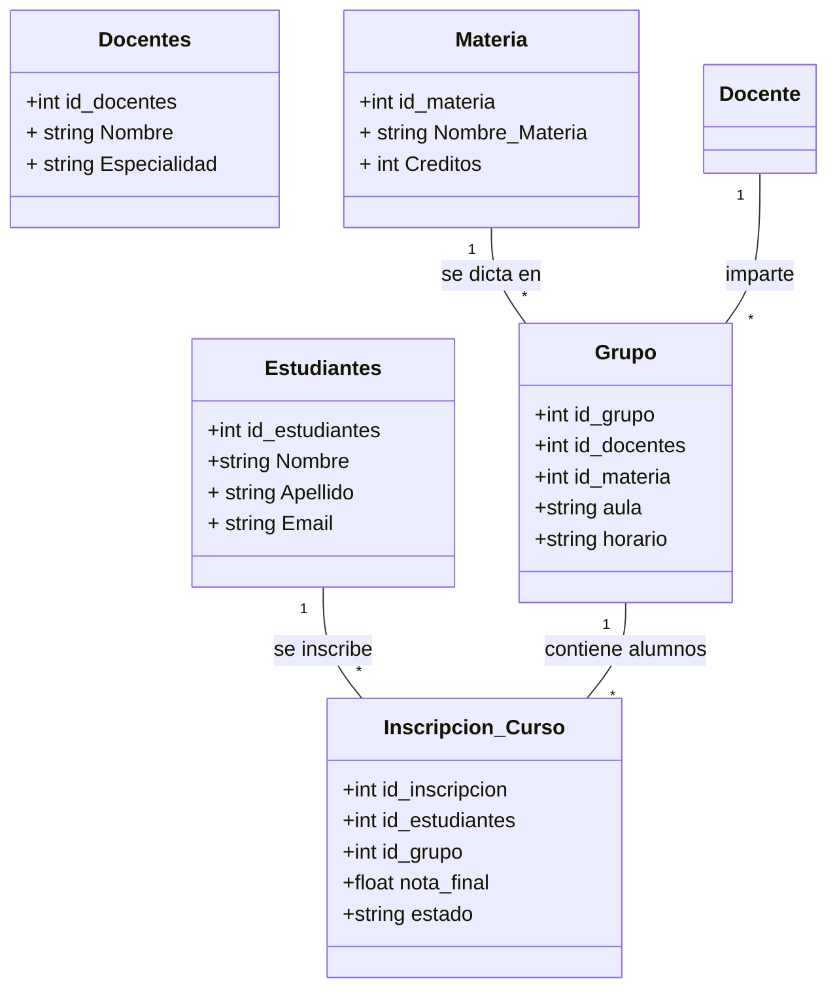

# Diagrama del ecosistema

```mermaid
classDiagram 

class Estudiantes {
    
    +int id_estudiantes
    +string Nombre
    + string Apellido
    + string Email
}

class Docentes {

    +int  id_docentes
    + string Nombre
    + string Especialidad
}

class Materia {
    
    +int id_materia
    + string Nombre_Materia
    + int Creditos

}
class Grupo {
    
    +int id_grupo
    +int id_docentes
    +int id_materia
    +string aula
    +string horario
}

class Inscripcion_Curso {

    +int id_inscripcion
    +int id_estudiantes
    +int id_grupo
    +float nota_final
    +string estado
}

Estudiantes "1" -- "*"Inscripcion_Curso : se inscribe
    Grupo "1" -- "*" Inscripcion_Curso : contiene alumnos
    Materia "1" -- "*" Grupo : se dicta en
    Docente "1" -- "*" Grupo : imparte
```
